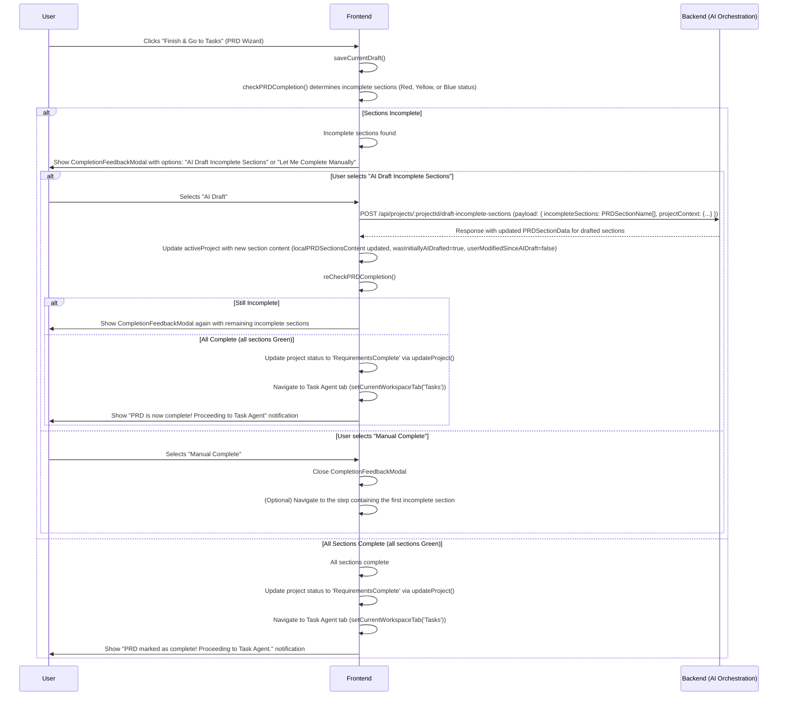
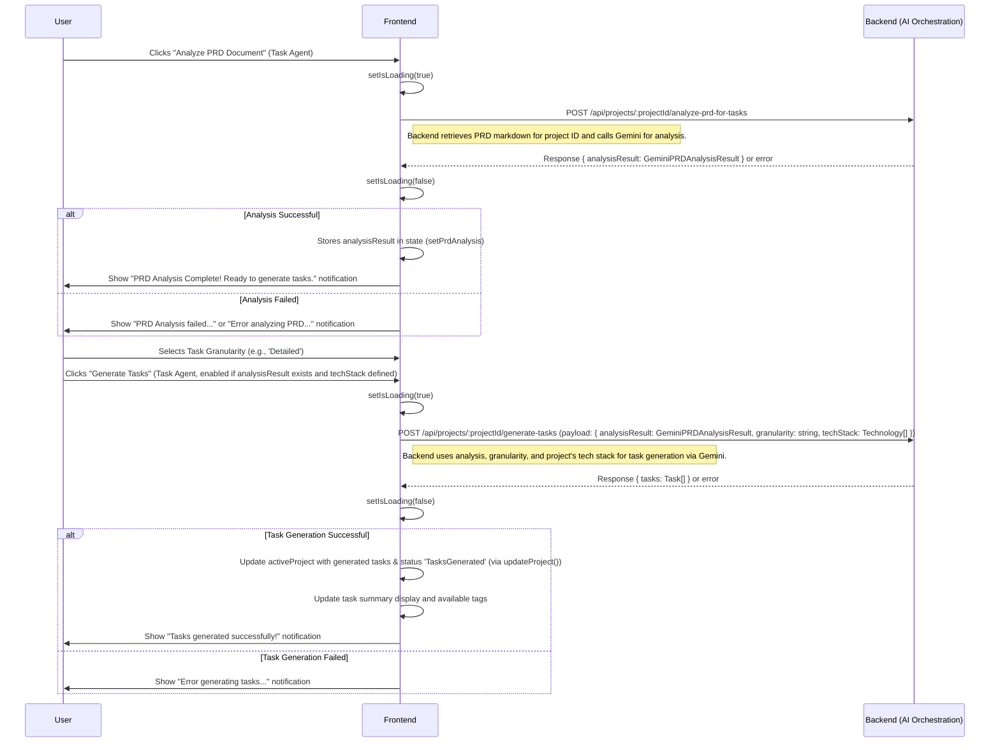

# Complex Client-Side Workflows

This document illustrates complex client-side workflows using Mermaid diagrams.

## 1. PRD Health Check & Finalization Flow

This flow describes the process when a user clicks "Finish & Go to Tasks" in the PRD Wizard.

## 2. Task Generation Flow

This flow describes the process from PRD analysis to task generation within the Task Agent.

